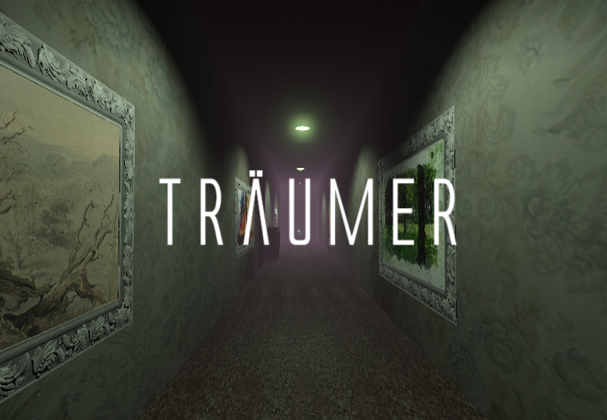
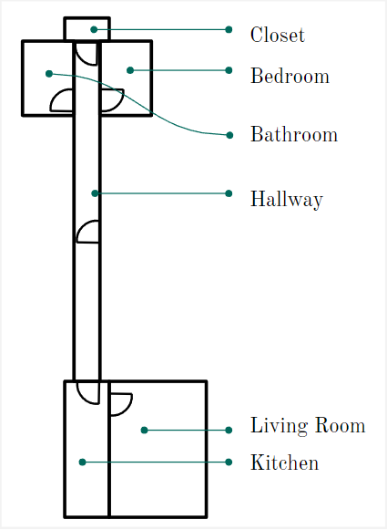
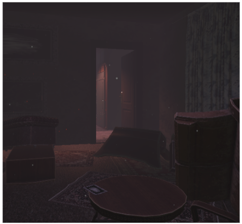

# Traumer

*Winter 2023*

## Concept

_Träumer_ is a VR experience where the player embodies a character suffering from amnesia regarding the loss of a loved one. By putting themselves in the shoes of this character, the player can gradually discover their memories and remember with them the origin and nature of their grief. The experience is very metaphorical and pictorial, and is therefore subject to interpretation.

*Träumer* is a small game developed as part of a course on VR development in winter 2023 at our university *Université de Technologie de Compiègne*. Our idea was to broach the topic of grief through an immersive game with dreamlike sequences to convey emotions and a sense of grief following the 5-step model (denial, anger, negociation, depression, acceptation), using sound and visual ambiance to accompany the development of the story and introduce feelings.

> [!NOTE]  
> Being a university project this experience is not 100% finished nor optimised.

> [!NOTE] 
> 3D choice experience based on the same topic using most of this project's assets but with differences in gameplay and storytelling: https://github.com/sfremann/Traummacher

---

## Credits

- Sarah Frémann (https://github.com/sfremann)
- Victor Billaud (https://github.com/victr-bld)

  
Details

  ### Design & Writing
  
  - Scenario: Sarah Frémann & Victor Billaud
  - Design of the appartment: Sarah Frémann & Victor Billaud

  
  
  ### Programming & Engineering
  
  - Basic gameplay/ direct interaction: mostly Victor Billaud with help from Sarah Frémann
  - More complex interaction: Sarah Frémann & Victor Billaud
  - Environment behavior: mostly Sarah Frémann with help from Victor Billaud
  - Putting things together/ Solving conflict: mostly Sarah Frémann with help from Victor Billaud
  - Testing/ Debug: Sarah Frémann & Victor Billaud
  
  ### Visuals
  
  - Effects & transitions / shaders: Sarah Frémann
  - Environment & light: Sarah Frémann
  
  ### Audio 
  
  - Sound selection: mostly Victor Billaud with help from Sarah Frémann
  - Effects & transitions: Sarah Frémann & Victor Billaud
  
  

  
Technologies & resources

  - Unity 2021.3.25
  - Audacity
  - paint.net
  - Inky
  - Blender

> [!NOTE] 
> Most models and sounds are free-to-use assets we found on Unity Asset Store, Pixabay, Sketchfab, Poly Haven. 

---

## How to use

> [!IMPORTANT]  
> To launch *Träumer*, you need an HTC Vive virtual reality headset with controllers (at least one), a sound device (headphones are preferable for better immersion) and a computer with the *Träumer* executable file. Next, you need to configure the room in SteamVR according to your preferred installation: standing or sitting. 

  
Gameplay

  Launch the Traum.exe application on your computer. Then simply put on the headset and launch the experience by touching the Play button with the VR controller. To exit the experience, remove the headset and press the Escape key on the computer keyboard.
  
  Movement is simply controlled by the controller's trackpad. Note that the speed is analogue and proportional to the position of the finger (the further it is from the centre of the trackpad, the faster the character moves).
  
  Interaction with an object is simply a matter of touching it. There's no need to press a button or trigger.

  To move forward in the game you have to interact with glowing objects. These interactions will trigger sequences and open the door to the next room.
  
  

